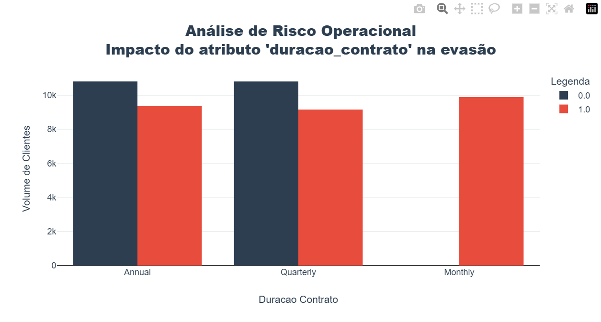
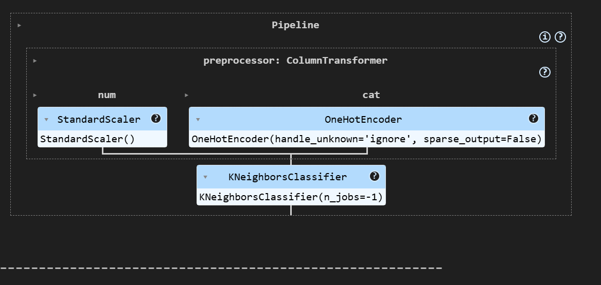
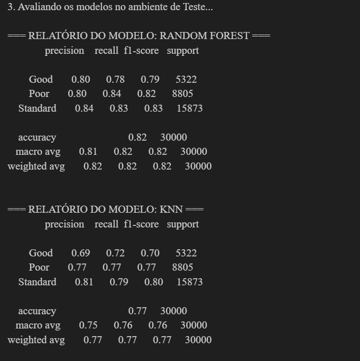

<div align="center">
  <sub>Arquitetura e Engenharia de Software por <a href="https://github.com/PedroLuizskt">Pedro Luiz</a></sub>
</div>

<div align="center">
  
  
  <a href="https://github.com/PedroLuizskt">
    
  </a>
</div>

<div align="center">

[](https://www.python.org/)
[](https://pandas.pydata.org/)
[](https://scikit-learn.org/)
[](https://openai.com/)
[](https://git-scm.com/)

</div>

---

## 🚀 Sobre o repositório:

Este repositório documenta a evolução técnica dos desafios propostos na **"Jornada Python"**. O objetivo central transcende a criação de scripts funcionais; o foco deste portfólio é a **Engenharia de Software e Arquitetura de Dados Aplicada**.

A cada novo módulo, os códigos originais (de caráter introdutório e procedural) foram sistematicamente refatorados para padrões de produção (*Production-Ready*). A base de código aqui apresentada demonstra o domínio sobre os seguintes pilares arquiteturais:

* **Escalabilidade & Manutenibilidade:** Transição de scripts lineares para arquiteturas Orientadas a Objetos (POO) e módulos desacoplados.
* **Governança de Dados:** Implementação de pipelines analíticos limpos, *Feature Engineering* dinâmica (sem *Data Leakage*) e tolerância a falhas (NaN handling).
* **Segurança (SecOps):** Blindagem de aplicações em nuvem utilizando variáveis de ambiente e proteção de credenciais contra vazamentos.

---

## 🤖 Desafio de Projeto 01: Motor RPA para Cadastro de Dados em Massa

O primeiro desafio consiste na construção de um robô de automação (*Robotic Process Automation*) focado na inserção em massa de produtos em um sistema web. O projeto original propunha um script linear para controle de mouse e teclado.

**O Desafio de Engenharia:** Evoluir a automação para uma arquitetura Orientada a Objetos, isolar as coordenadas de tela em dicionários de configuração (para garantir portabilidade entre diferentes monitores) e utilizar o Pandas para iteração dinâmica e tratamento de dados ausentes (NaN).

### ⚙️ A Engenharia por Trás do Código

O motor foi segmentado em duas frentes: a lógica de negócios (leitura e tratamento de dados) e a execução mecânica (controle de periféricos virtuais).

#### 1. Arquitetura Orientada a Objetos e Injeção de Dependências
A automação foi encapsulada na classe `AutomacaoCadastroWeb`. As coordenadas físicas do monitor, que costumam gerar *Magic Numbers* polindo o código, foram extraídas para um dicionário de configuração no escopo `__main__`. Isso permite que o robô seja recalibrado para qualquer computador sem que a lógica interna da classe precise ser alterada.

#### 2. Extração e Iteração Otimizada com Pandas
Em vez de depender de laços manuais frágeis, o sistema ingere o arquivo `produtos.csv` diretamente para a memória RAM através de um `DataFrame` do Pandas. A inserção no formulário web ocorre por meio de uma iteração dinâmica sobre as colunas da tabela:

```python
# Iteração dinâmica e tratamento de valores nulos (Not a Number - NaN)
for col in colunas_formulario:
    valor_celula = linha[col]
    if pd.isna(valor_celula):
        pyautogui.write("") # Garante que campos vazios não quebrem o fluxo
    else:
        pyautogui.write(str(valor_celula))
```
Isso garante que, se o sistema web adicionar ou remover campos no futuro, basta alterar a lista `colunas_formulario`, mantendo o motor intacto.

#### 3. Calibração Espacial em Tempo Real e Fail-Safes
Para resolver o gargalo de mapeamento de coordenadas, foi desenvolvido um utilitário de *Continuous Listener* (`pegar_posicao_re.py`) que exibe a posição X e Y do cursor no terminal em tempo real. Além disso, a arquitetura respeita o *Fail-Safe* nativo do PyAutoGUI: jogar o mouse para qualquer canto da tela aborta o processo imediatamente em caso de anomalia.

---

### 🛠️ Estrutura do Projeto

```text
📦 jornada-python-refactored
 ┣ 📂 Aula01
 ┃ ┣ 📜 gabarito_re.py           # Classe principal do Robô e regras de negócio
 ┃ ┣ 📜 pegar_posicao_re.py      # Utilitário de mapeamento espacial em tempo real
 ┃ ┗ 📜 produtos.csv             # Base de dados estruturada
 ┣ 📜 .gitignore                 # Prevenção de cache e arquivos locais
 ┗ 📜 README.md                  # Documentação arquitetural
```

### 🎮 Como Executar a Simulação

Este projeto requer as bibliotecas `pyautogui` e `pandas`. 

1. **Acesse o diretório do projeto e instale as dependências:**
```bash
cd Aula01
pip install pyautogui pandas
```

2. **Calibre o seu monitor (Mapeamento):**
Abra o site do sistema alvo no seu navegador. Execute o utilitário abaixo e anote as coordenadas X e Y do campo de E-mail, Botão de Login e Primeiro Campo do Formulário:
```bash
python pegar_posicao_re.py
```

3. **Injete as configurações e Execute:**
Abra o arquivo `gabarito_re.py`, substitua os valores no dicionário `MAPEAMENTO_MONITOR` pelas coordenadas que você anotou. Em seguida, inicie o robô:
```bash
python gabarito_re.py
```
> **Aviso de Operação:** Assim que pressionar `Enter` para iniciar o robô, solte o mouse e o teclado para evitar concorrência de controle com o Sistema Operacional.

---

## 📊 Desafio de Projeto 02: Inteligência de Retenção e Churn Analytics

O segundo desafio aprofunda-se na Ciência de Dados aplicada aos negócios, focando na identificação e mitigação de **Churn** (evasão de clientes) em um modelo de assinaturas (SaaS). O projeto original propunha uma análise exploratória linear, baseada em saídas de terminal e visualizações genéricas.

**O Desafio de Engenharia:** Elevar o script procedural para um motor analítico orientado a objetos, aplicar princípios rigorosos de *Data Storytelling* (design corporativo e cores semânticas) e encapsular a lógica de filtros em um modelo preditivo de cenários (*What-If Analysis*).

### ⚙️ A Engenharia por Trás do Código

A refatoração transformou um simples arquivo de exploração em uma ferramenta de *Business Intelligence* robusta e modular.

#### 1. Motor Analítico Encapsulado (OOP) e Prevenção de Estado
Em ambientes REPL como o Jupyter Notebook, variáveis soltas podem causar vazamento de escopo (*scope leak*) e dados fantasmas. Para resolver isso, toda a pipeline de ETL (Extração, Transformação e Carga) e plotagem foi encapsulada na classe `ChurnIntelligence`. Isso garante que a ingestão, a limpeza de dados (*Listwise Deletion*) e a análise rodem em um estado limpo e determinístico.

#### 2. Data Storytelling e Customização de UI (`plotly.io`)
Gráficos com cores aleatórias não geram decisões eficientes. Implementei uma camada de *Styling* corporativo modificando os *templates* globais do Plotly. 
Foi criada a constante `CHURN_PALETTE`, garantindo que a evasão seja sempre sinalizada em Vermelho (Alerta) e a retenção em Azul Escuro. Além disso, o design removeu grades desnecessárias (Tufte's Data-Ink Ratio) para focar estritamente na diferença volumétrica entre as coortes.

#### 3. Projeção Algorítmica de Cenários (What-If Analysis)
Em vez de apenas constatar o passado, o motor analítico foi programado para simular o futuro. O método `simulate_business_rules()` aplica máscaras booleanas dinâmicas baseadas nos *thresholds* encontrados na análise visual (ex: limite de 4 chamados de suporte e extinção de contratos mensais). O algoritmo recalcula a base e prova matematicamente o ROI da análise: **projetando a redução da taxa de Churn de 56.71% para 18.40%**.

---

### 🛠️ Estrutura do Projeto

```text
📦 jornada-python-refactored
 ┣ 📂 Aula02
 ┃ ┣ 📜 analise_churn_re.ipynb       # Notebook estruturado com Motor OOP e Storytelling
 ┃ ┣ 📜 cancelamentos_sample.csv     # Base de dados de assinaturas (Input)
 ┃ ┗ 🖼️ duracao_contrato_evasao_gra.png # Asset visual (Output)
```

### 🎮 Como Executar a Análise

Este módulo foi projetado para execução em ambientes de Notebook (Jupyter Lab ou VS Code com extensão Jupyter).

1. **Navegue até o diretório e instale as dependências:**
```bash
cd Aula02
pip install pandas plotly nbformat
```

2. **Execução Interativa:**
Abra o arquivo `analise_churn_re.ipynb` na sua IDE de preferência. A estrutura modular permite que você execute a célula de configuração da classe (`ChurnIntelligence`) e, em seguida, chame os métodos de plotagem individualmente para explorar interativamente os atributos:
```python
analise = ChurnIntelligence("cancelamentos_sample.csv")
analise.ingest_and_clean()
analise.plot_feature_impact("dias_atraso")
```
<br>

<div align="center">
  
  <br>
  <sub><i>Dashboard analítico focado na identificação de Thresholds (Limiares de Ruptura) de Churn.</i></sub>
</div>

<br>

---

## 🧠 Desafio de Projeto 03: Arquitetura de Machine Learning para Credit Scoring

O terceiro desafio mergulha no ecossistema de Inteligência Artificial e modelagem preditiva para o mercado financeiro, com o objetivo de classificar o *score* de crédito de clientes (Ruim, Ok, Bom). O projeto original propunha um script linear que sofria de gargalos arquiteturais graves, como o uso incorreto de codificadores ordinais e vazamento de dados (*Data Leakage*).

**O Desafio de Engenharia:** Evoluir um script estatístico amador para um **Pipeline Enterprise** robusto utilizando *Scikit-Learn*, corrigindo distorções matemáticas (*Scaling* e *Encoding*), isolando transformações e garantindo resiliência total para inferência de novos dados em produção.

### ⚙️ A Engenharia por Trás do Código

A refatoração transformou um fluxo vulnerável a quebras em um motor de IA encapsulado, modular e preparado para integração com APIs.

#### 1. Pipelines Modulares e Prevenção de Data Leakage
No desenvolvimento original, o tratamento de dados ocorria em todo o *dataset* antes da separação entre Treino e Teste, permitindo que o modelo "espiasse" o futuro (*Data Leakage*). A arquitetura refatorada introduz o objeto `Pipeline` do Scikit-Learn. Agora, as transformações estatísticas aprendem suas regras exclusivamente com a base de treino e apenas as aplicam à base de teste, garantindo uma validação matemática real e sem viés.

#### 2. Feature Engineering Dinâmica (`ColumnTransformer`)
Foi eliminado o anti-padrão de usar `LabelEncoder` para atributos categóricos independentes (que ensinava ao modelo que um "médico" valia mais que um "cientista"). O sistema agora utiliza um roteador dinâmico:
* **One-Hot Encoding:** Para dados em texto (categorias). Adicionamos o fail-safe `handle_unknown='ignore'`, garantindo que se um cliente novo chegar com uma profissão inédita em produção, o sistema não sofra um *Crash* (*ValueError*).
* **StandardScaler:** Para variáveis numéricas. Isso corrige a "cegueira" do algoritmo *K-Nearest Neighbors (KNN)*, colocando idades (dezenas) e salários (milhares) na mesma régua de distância euclidiana.

#### 3. Avaliação de Risco Focada em Negócios (Business Metrics)
O motor original avaliava os modelos apenas por "Acurácia Global". Em cenários de crédito com dados desbalanceados, essa métrica é uma ilusão. A avaliação foi elevada para o uso do `classification_report`, focando na métrica de **Recall** da classe *Poor* (Ruim). O sistema agora foca em responder à pergunta de milhões de reais do banco: *"De todos os clientes que realmente vão dar calote, quantos o nosso modelo conseguiu bloquear?"*

---

### 🛠️ Estrutura do Projeto

```text
📦 jornada-python-refactored
 ┣ 📂 Aula03
 ┃ ┣ 📜 aula3_re.ipynb                # Notebook estruturado com ML Pipelines e ColumnTransformer
 ┃ ┣ 📜 clientes.csv                  # Base de dados histórica corporativa (Input/Treino)
 ┃ ┣ 📜 novos_clientes.csv            # Base de dados para simulação de inferência (Produção)
 ┃ ┣ 🖼️ ColumnTransformer.png         # Diagrama da arquitetura de transformação de features
 ┃ ┗ 🖼️ relatorio_modelos.png         # Output das métricas corporativas de validação
```

### 🎮 Como Executar a Simulação Preditiva

Este módulo de Inteligência Artificial foi projetado para execução em ambientes de Notebook (Jupyter Lab ou VS Code).

1. **Navegue até o diretório e instale as dependências analíticas:**
```bash
cd Aula03
pip install pandas scikit-learn
```

2. **Execução Interativa e Treinamento:**
Abra o arquivo `aula3_re.ipynb` na sua IDE. O motor de IA utiliza processamento paralelo (`n_jobs=-1`) para utilizar todos os núcleos da sua CPU durante o treinamento da *Random Forest* e do *KNN*.

3. **Validação Visual:**
Ao executar as células de avaliação, o motor não apenas preverá o *score* dos clientes em `novos_clientes.csv`, mas gerará o relatório completo com a prova matemática do desempenho algorítmico.

<br>

<div align="center">
  
  <br>
  <sub><i>Arquitetura do ColumnTransformer: Roteamento dinâmico de tratamento numérico e categórico.</i></sub>
</div>

<br>

<div align="center">
  
  <br>
  <sub><i>Classification Report evidenciando o Recall de 84% para detecção de perfis de alto risco financeiro.</i></sub>
</div>

<br>

---

## 🤖 Desafio de Projeto 04: Arquitetura de Assistente Virtual (LLM) e SecOps

O quarto desafio coroa a jornada com a integração de Inteligência Artificial Generativa. O objetivo era construir uma interface de chat capaz de manter contexto e conversar de forma inteligente. No entanto, o projeto original apresentava falhas críticas de segurança corporativa (credenciais expostas no código) e falta de governança sobre o comportamento da IA.

**O Desafio de Engenharia:** Refatorar um protótipo vulnerável para uma **Arquitetura Enterprise de IA**, implementando cofres de credenciais (*Environment Variables*), controle de estado de sessão (*Session State Management*), resiliência de API e injeção de *System Prompts* para governança de respostas.

### ⚙️ A Engenharia por Trás do Código

O motor analítico foi redesenhado para separar estritamente a interface do usuário (Frontend) da lógica de comunicação com os servidores da OpenAI (Backend/API).

#### 1. SecOps e Proteção de Credenciais (`.env`)
No ecossistema de Nuvem, *hardcodar* chaves de API no código-fonte é o caminho mais rápido para o vazamento de dados e prejuízos financeiros severos. A arquitetura foi refatorada para utilizar a biblioteca `dotenv`. A chave da OpenAI agora reside exclusivamente em um arquivo oculto e não-rastreável (`.env`), sendo injetada na aplicação apenas no momento da execução (em memória).

#### 2. Governança de IA e Engenharia de Prompt (Guardrails)
Modelos fundacionais como o GPT-4 são generalistas. Para transformá-lo em um assistente corporativo útil, foi implementado o controle de contexto através da injeção silenciosa de um **System Prompt** no estado da sessão:
```python
{"role": "system", "content": "Você é um assistente corporativo sênior..."}
```
Isso estabelece os limites operacionais do modelo, forçando-o a adotar uma *persona* técnica, concisa e formatada, evitando alucinações ou respostas fora do escopo do negócio.

#### 3. Resiliência, UX e Otimização de Custos
Aplicações que dependem de APIs de terceiros estão sujeitas a falhas de rede (*Timeouts*). 
* **Tolerância a Falhas:** A comunicação com a OpenAI foi encapsulada em blocos `try/except`, garantindo que quedas de conexão gerem alertas amigáveis na interface, em vez de derrubar (*Crash*) a aplicação inteira.
* **FinOps (Custos):** O modelo foi migrado estrategicamente para o `gpt-4o-mini`, reduzindo o custo computacional e financeiro em quase 90% para o projeto, mantendo a latência baixíssima e a inteligência intacta para tarefas corporativas padrão.

---

### 🛠️ Estrutura do Projeto

```text
📦 jornada-python-refactored
 ┣ 📂 Aula04
 ┃ ┣ 📜 app_chatbot.py            # Motor principal com Streamlit, OpenAI e Error Handling
 ┃ ┣ 📜 .env.example              # Template de segurança (Mostra onde inserir a API Key localmente)
 ┃ ┗ 🖼️ chatbot_interface.png     # Asset visual da interface renderizada
```

### 🎮 Como Executar a Aplicação de IA

Este módulo requer a configuração prévia de chaves de ambiente para se comunicar com os servidores da OpenAI.

1. **Instalação do Ecossistema:**
Acesse a pasta do projeto e instale as dependências de interface, IA e segurança:
```bash
cd Aula04
pip install streamlit openai python-dotenv
```

2. **Configuração do Cofre de Chaves (SecOps):**
Crie um arquivo chamado `.env` na raiz da pasta `Aula04` e insira sua chave da OpenAI gerada no painel de desenvolvedor:
```text
OPENAI_API_KEY=sk-proj-sua-chave-aqui
```

3. **Inicialização do Servidor Local:**
Inicie o motor do Streamlit. O sistema fará o *bind* automático em uma porta local (geralmente `http://localhost:8501`) e abrirá a interface no seu navegador padrão:
```bash
streamlit run app_chatbot.py
```

<br>

---

---

## 🏁 Conclusão da Jornada: De Scripts a Sistemas

A **Jornada Python** provou ser um excelente ecossistema para demonstrar o poder da linguagem em diferentes frentes tecnológicas. No entanto, o verdadeiro valor deste repositório reside na **camada de engenharia** aplicada sobre os projetos base.

Ao longo de 4 desafios, documentamos na prática a transição essencial que diferencia um código que "apenas funciona" de um sistema preparado para o mundo corporativo:

1. **RPA:** Evoluímos do uso de coordenadas físicas (*magic numbers*) para um motor orientado a objetos dinâmico e portátil.
2. **Business Intelligence:** Saímos de gráficos dispersos para a construção de um motor analítico com projeção de cenários preditivos (*What-If Analysis*).
3. **Machine Learning:** Eliminamos vazamentos de dados com a implementação de *Scikit-Learn Pipelines*, focando em métricas reais de negócio (*Recall* financeiro).
4. **Inteligência Artificial:** Estruturamos a fundação de aplicações com LLMs aplicando isolamento de segurança (*.env*) e governança contextual (*System Prompts*).

### 🤝 Conecte-se
Este portfólio é um documento vivo do meu comprometimento com as melhores práticas de Arquitetura de Software e Dados. Sinta-se à vontade para explorar o código-fonte, clonar os projetos ou conectar-se comigo para discutirmos tecnologia, engenharia e arquitetura de soluções.

<div align="center">
  <br>
  <i>"Bons programadores escrevem códigos que computadores entendem. Grandes programadores escrevem códigos que humanos entendem."</i> — <b>Martin Fowler</b>
</div>


